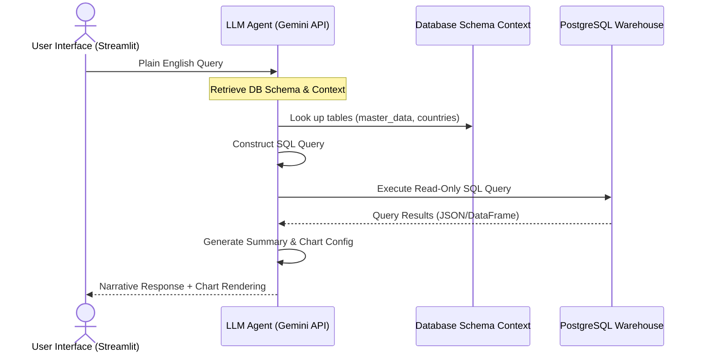

# Product Specification: Cross-Continental Eco-Economic Data Pipeline

**Document Version:** 1.0.0  
**Author:** Devothama GN, Product Manager (AI/Data Platform)  
**Status:** Approved for Implementation  

---

## 1. Executive Summary & Product Vision

In the modern global economy, environmental anomalies (e.g., climate change, extreme weather) and energy resource fluctuations have direct, rapid, and severe impacts on local food security and macroeconomic indicators. However, researchers, policy-makers, and supply-chain risk officers face a fragmented data ecosystem where weather data, commodities prices, energy production, and GDP figures exist in siloed API services and varying standards.

**Our Vision:** To build a unified, automated data platform that aggregates and standardizes cross-continental climate, energy, commodities, and macroeconomic data, serving it through user-friendly REST APIs and an AI-powered conversational assistant to enable real-time risk modeling and decision-making.

---

## 2. Target Users & User Personas

| Persona | Core Needs | Pain Points | Platform Use Case |
| :--- | :--- | :--- | :--- |
| **Commodity Risk Analyst** | Predict food price volatility and supply chain disruption risks. | Manually combining CSV files from World Bank, WFP, and weather stations is slow and error-prone. | Uses the REST API / `master_data` unified view to feed quantitative models predicting price spikes. |
| **International Policy Adviser** | Evaluate the impact of climate changes on national economies to allocate aid resources. | Lack of normalized historical context matching macroeconomic growth (GDP) with weather indices. | Leverages the queryable database to run cross-country regressions comparing precipitation with agricultural inflation. |
| **Agricultural Enterprise PM** | Plan long-term sourcing and logistics strategies based on continental eco-economic trends. | Technical complexity of running database ETL pipelines from multiple global vendors. | Uses the interactive dashboard and AI natural language querying to get instant insight summaries. |

---

## 3. Product Value Proposition

```
[ fragmented APIs & static CSVs ] 
               │
               ▼ (Standardization Engine)
[ unified country_code + year_month join key ]
               │
               ▼ (Serving Layer)
[ Live API Endpoints + AI Conversational Querying ]
```

* **Zero Integration Friction:** Unified data keyed by ISO3 `country_code` and `year_month` removes hours of data engineering work for downstream analysts.
* **Dual Execution Efficiency:** Optimized ingestion routines featuring full historical backfills and automated weekly incremental refreshes via containerized cron jobs.
* **Explainable Data Lineage:** Full auditability from raw ingestion schemas to clean warehouse analytical tables (`master_data`).

---

## 4. Key Performance Indicators (KPIs)

To evaluate the platform's reliability, efficiency, and business value, we track the following product and system metrics:

* **Ingestion Latency (System Performance):** Total execution time for incremental data refresh must be `< 3 minutes` weekly.
* **Data Completeness (Product Quality):** Percentage of monthly analytical records in `master_data` without null fields across all 4 key domains (climate, energy, food, economics) must exceed `95%`.
* **API Response Time (User Experience):** P95 latency for analytical queries on `/api/get_all` must be `< 150ms`.
* **AI Query Success Rate (AI Accuracy):** Percentage of natural language queries successfully translated to valid, context-appropriate SQL queries must exceed `90%`.

---

## 5. Product Feature Roadmap

```
┌─────────────────────────────────┐
│  Phase 1: Foundation (Current)  │ ──► PostgreSQL Warehouse, Docker, REST API, Crons
└─────────────────────────────────┘
                 │
                 ▼
┌─────────────────────────────────┐
│   Phase 2: AI Query (Planned)   │ ──► Streamlit Interface, NL-to-SQL LLM Engine, RAG
└─────────────────────────────────┘
                 │
                 ▼
┌─────────────────────────────────┐
│  Phase 3: Predictive Analytics  │ ──► ML models for Food Price Volatility prediction
└─────────────────────────────────┘
```

---

## 6. AI Integration Spec: Natural Language SQL Assistant (Phase 2)

### 6.1 Goal & User Experience
To democratize access to the data warehouse, we will introduce a Conversational AI Chatbot interface. Non-technical users (e.g., policy advisers) can ask analytical questions in plain English, and the AI will automatically fetch the data, compute summaries, and generate charts.

* **Example User Prompt:** *"Show me the correlation between monthly precipitation and wheat prices in India between 2023 and 2025."*
* **AI Output:** A localized table, a Pearson correlation coefficient, and an interactive line chart.

### 6.2 Chatbot Architecture & Data Flow



### 6.3 Technical Implementation Plan

1. **Frontend (Streamlit):**
   * A clean, lightweight interface featuring a chat input window and chart rendering containers (using Streamlit's native charting or Plotly).
2. **AI SQL Generator (Gemini Flash / OpenAI API):**
   * Uses few-shot prompting containing the database schema (DDL statements of `master_data`, `countries`, `energy`, etc.) and system instructions constraining the model to **read-only SELECT queries** to prevent SQL injection.
3. **Execution Guardrail:**
   * Custom middleware that intercepts the generated SQL, parses it to ensure no write commands (`INSERT`, `UPDATE`, `DROP`, `DELETE`) exist, and runs it against a read-only database user credentials connection.
4. **Response Synthesizer:**
   * Pass the database results back to the LLM to write a concise, executive-level summary of the findings.

---

## 7. AI Predictive Modeling (Phase 3)

The unified `master_data` dataset serves as the ideal training matrix for predictive machine learning models:
* **Predictive Target:** `rice_price_usd_per_kg` / `wheat_price_usd_per_kg`.
* **Features:** Lagged weather variables (temperature/precipitation anomalies), energy cost trends (electricity/petroleum consumption ratios), and inflation indices.
* **AI PM Focus:** Providing early-warning alerts for food supply chain operations before pricing spikes occur.
