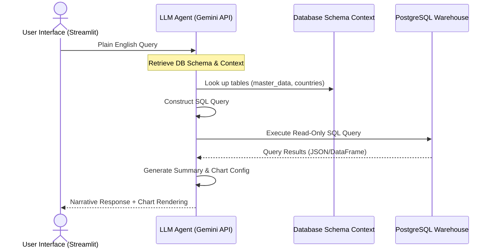
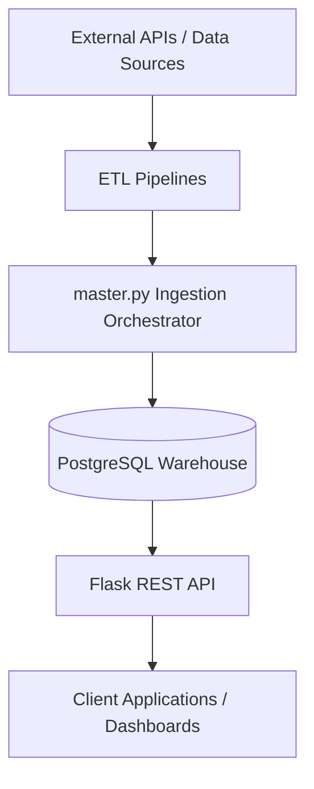

# Cross-Continental Eco-Economic Data Pipeline

## Overview

## Product Motivation

This project was designed as a reusable data platform for cross-country environmental and economic analysis. The goal was not only to build ETL scripts, but to create a system that could help users monitor how climate, food prices, energy usage, and macroeconomic conditions change over time.

From a product perspective, the platform focuses on:

- Turning fragmented datasets into one usable analytical view
- Reducing manual data collection through automated refreshes
- Making data accessible through APIs for downstream applications
- Supporting future AI/ML use cases such as forecasting, anomaly detection, and cross-country risk analysis

This project is an end-to-end automated data engineering platform that integrates environmental and economic datasets from multiple global sources into a centralized PostgreSQL data warehouse.

The platform collects, transforms, standardizes, and serves data through a REST API, enabling cross-country analysis of weather, food prices, energy production/consumption, and macroeconomic indicators.

### Target Countries
* United States
* Brazil
* India
* Philippines
* Nigeria

The system is fully containerized using Docker and supports automated refreshes through scheduled cron-based workflows.

---

## Product Strategy & Vision

This platform was designed and built with a product-first methodology to bridge the gap between complex climate and economic data engineering and downstream analytical consumers.

## AI / ML Readiness

The pipeline creates a clean, standardized monthly dataset that can be used as input for future AI and machine learning workflows.

Potential use cases include:

- Forecasting food price changes
- Detecting climate or economic anomalies
- Modeling relationships between weather, energy usage, and food prices
- Building dashboards or decision-support tools for policy and operations teams

The current project focuses on the data infrastructure layer required before reliable AI models can be built.


## Product & Engineering Decisions

Key decisions made during the project included:

- Using `country_code` and `year_month` as common join keys to make multiple datasets interoperable
- Preserving missing source coverage as nulls instead of dropping records, so users can see real data gaps
- Separating historical backfill from incremental updates to make the system more scalable
- Using Docker Compose to make the system reproducible across environments
- Exposing the final dataset through REST APIs so downstream tools can consume the data without direct database access

- 
### 🎯 Target User Personas
| Persona | Core Needs | Pain Points | Platform Use Case |
| :--- | :--- | :--- | :--- |
| **Commodity Risk Analyst** | Predict food price volatility and supply chain disruption risks. | Manually combining CSV files from World Bank, WFP, and weather stations is slow and error-prone. | Uses the REST API / `master_data` unified view to feed quantitative models predicting price spikes. |
| **International Policy Adviser** | Evaluate the impact of climate changes on national economies to allocate aid resources. | Lack of normalized historical context matching macroeconomic growth (GDP) with weather indices. | Leverages the queryable database to run cross-country regressions comparing precipitation with agricultural inflation. |

### 📊 Key Performance Indicators (KPIs)
* **Ingestion Latency (System Performance):** Total execution time for incremental data refresh must be `< 3 minutes` weekly.
* **Data Completeness (Product Quality):** Percentage of monthly analytical records in `master_data` without null fields across all 4 key domains (climate, energy, food, economics) must exceed `95%`.
* **API Response Time (User Experience):** P95 latency for analytical queries on `/api/get_all` must be `< 150ms`.
* **AI Query Success Rate (AI Accuracy):** Percentage of natural language queries successfully translated to valid, context-appropriate SQL queries must exceed `90%`.

---

## AI Conversational Assistant (Upcoming Feature Spec)

To democratize database access for non-technical users, we designed a **Conversational SQL Assistant** chatbot that translates plain English prompts into safe, read-only SQL queries executed against our warehouse.



* 🚀 **Read-Only Guards:** Protects against SQL injection by filtering and stripping mutating commands (`INSERT`, `UPDATE`, `DELETE`, `DROP`).
* 📊 **Insight Summarization:** Runs database results back through the Gemini LLM to write a concise, executive-level summary of findings.

---

## Product Documentation & Specs

* 🎯 **[Product Specification Document (Full AI PM Spec)](./PRODUCT_SPEC.md)**: Product vision, roadmap detail, target personas, and validation guardrails.
* 📄 **[Project Documentation PDF (Technical Report)](./Project%20Documentation.pdf)**: Report detailing the database schemas, ETL pipelines flowcharts, validation checks, and data quality rules.

---

## Architecture



---

## Key Features

### Automated Data Ingestion
* **World Bank Open Data API** — Macroeconomic indicators
* **U.S. Energy Information Administration (EIA) API** — Energy statistics
* **Open-Meteo Weather API** — Climate-related variables
* **World Food Programme (WFP) Food Price Dataset** — Food prices

### Data Engineering Pipeline
* Historical backfill support
* Incremental update processing
* Data standardization using `country_code` and `year_month`
* Deduplication and validation checks
* Automated ETL orchestration

### Backend Services
* Flask REST API
* PostgreSQL data warehouse
* JSON-based analytical endpoints

### Infrastructure & Automation
* Dockerized deployment
* Docker Compose orchestration
* Cron-based scheduled refreshes
* Environment-based configuration management

---

## Tech Stack

* **Languages:** Python, SQL
* **Data Engineering:** Pandas, SQLAlchemy, BeautifulSoup, Requests
* **Database:** PostgreSQL
* **Backend:** Flask
* **Infrastructure:** Docker, Docker Compose, Cron

---

## Project Structure

```
.
├── app.py
├── master.py
├── config.py
├── world_bank.py
├── eia_energy.py
├── weather.py
├── food_prices.py
├── food_download.py
├── food_backfill.py
├── Dockerfile
├── docker-compose.yml
├── requirements.txt
├── .env.example
├── start_with_cron.sh
├── run_incremental.sh
├── cronjob
├── PRODUCT_SPEC.md
├── Project Documentation.pdf
└── README.md
```

---

## Setup & Execution

### 1. Clone the Repository
```bash
git clone https://github.com/devothamgn321/cross-continental-eco-economic-data-pipeline.git
cd cross-continental-eco-economic-data-pipeline
```

### 2. Create the Environment File
```bash
cp env.example .env
```

### 3. Add EIA API Key
Register for a free API key at [EIA Open Data](https://www.eia.gov/opendata/register.php). Once received, update the `.env` file:
```env
EIA_API_KEY=YOUR_API_KEY_HERE
```

### 4. Build and Start Containers
```bash
docker compose up --build
```
> [!NOTE]
> The initial startup performs a full historical backfill, which can take several minutes.

---

## Available Services

| Service | URL |
| :--- | :--- |
| **Flask API** | [http://localhost:8001](http://localhost:8001) |
| **Health Check** | [http://localhost:8001/api/health](http://localhost:8001/api/health) |

---

## API Endpoints

### Health Check
`GET /api/health`

### Countries
`GET /api/get_countries`

### World Bank Indicators
`GET /api/get_world_bank`
* Returns: GDP, Inflation, Population

### Food Prices
`GET /api/get_food_prices`
* Returns: Rice prices, Wheat flour prices, Maize prices

### Energy Data
`GET /api/get_energy`
* Returns: Electricity production/consumption, Petroleum production/consumption, Natural gas production/consumption

### Weather Data
`GET /api/get_weather`
* Returns: Average temperature, Total precipitation

### Integrated Dataset
`GET /api/get_all`
* Returns the unified analytical dataset across all data sources.

---

## Automation Workflow

### Backfill Mode
Used during initial deployment.
```bash
PIPELINE_MODE=backfill python master.py
```
Builds the complete historical dataset.

### Incremental Mode
Used for ongoing maintenance.
```bash
PIPELINE_MODE=incremental python master.py
```
Processes only newly available data.

### Scheduled Refresh
Cron automatically executes `run_incremental.sh` every Sunday at 2:00 AM.

---

## Data Standardization

All datasets are transformed into a common schema using:
* `country_code` (ISO3)
* `year_month` (YYYY-MM)

This allows cross-source joins and unified analytics.

---

## Data Sources

* **Open-Meteo:** Historical weather observations ([open-meteo.com](https://open-meteo.com))
* **World Food Programme:** Global food price monitoring ([data.humdata.org](https://data.humdata.org/dataset/wfp-food-prices))
* **U.S. Energy Information Administration:** International energy statistics ([eia.gov/opendata](https://www.eia.gov/opendata))
* **World Bank Open Data:** Macroeconomic indicators ([data.worldbank.org](https://data.worldbank.org))

---

## Future Enhancements

* Additional countries and regions
* Expanded historical coverage
* Dashboard and visualization layer
* Airflow orchestration
* Streaming ingestion support
* Enhanced monitoring and alerting

---

## Team

* **David Denice**
* **Devothama Narasimhamurthy**
* **Robert Hula**
* **Natalya Ratra**

*Johns Hopkins University*  
**EN.685.652 – Data Engineering Principles and Practice**
