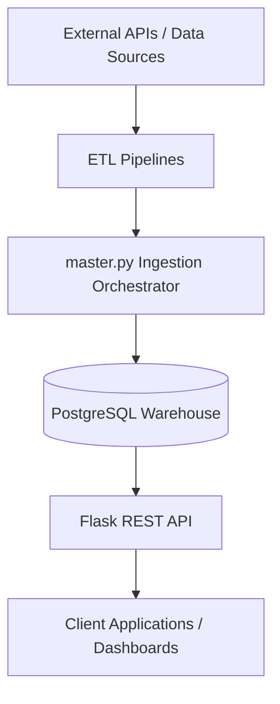

# Cross-Continental Eco-Economic Data Pipeline

## Overview

This project is an end-to-end automated data engineering platform that integrates environmental and economic datasets from multiple global sources into a centralized PostgreSQL data warehouse.

The platform collects, transforms, standardizes, and serves data through a REST API, enabling cross-country analysis of weather, food prices, energy production/consumption, and macroeconomic indicators.

### Target Countries
* United States
* Brazil
* India
* Philippines
* Nigeria

The system is fully containerized using Docker and supports automated refreshes through scheduled cron-based workflows.

---

## Architecture



---

## Key Features

### Automated Data Ingestion
* **World Bank Open Data API** — Macroeconomic indicators
* **U.S. Energy Information Administration (EIA) API** — Energy statistics
* **Open-Meteo Weather API** — Climate-related variables
* **World Food Programme (WFP) Food Price Dataset** — Food prices

### Data Engineering Pipeline
* Historical backfill support
* Incremental update processing
* Data standardization using `country_code` and `year_month`
* Deduplication and validation checks
* Automated ETL orchestration

### Backend Services
* Flask REST API
* PostgreSQL data warehouse
* JSON-based analytical endpoints

### Infrastructure & Automation
* Dockerized deployment
* Docker Compose orchestration
* Cron-based scheduled refreshes
* Environment-based configuration management

---

## Tech Stack

* **Languages:** Python, SQL
* **Data Engineering:** Pandas, SQLAlchemy, BeautifulSoup, Requests
* **Database:** PostgreSQL
* **Backend:** Flask
* **Infrastructure:** Docker, Docker Compose, Cron

---

## Project Structure

```
.
├── app.py
├── master.py
├── config.py
├── world_bank.py
├── eia_energy.py
├── weather.py
├── food_prices.py
├── food_download.py
├── food_backfill.py
├── Dockerfile
├── docker-compose.yml
├── requirements.txt
├── .env.example
├── start_with_cron.sh
├── run_incremental.sh
├── cronjob
└── README.md
```

---

## Setup & Execution

### 1. Clone the Repository
```bash
git clone https://github.com/devothamgn321/global-food-security-data-platform.git
cd global-food-security-data-platform
```

### 2. Create the Environment File
```bash
cp env.example .env
```

### 3. Add EIA API Key
Register for a free API key at [EIA Open Data](https://www.eia.gov/opendata/register.php). Once received, update the `.env` file:
```env
EIA_API_KEY=YOUR_API_KEY_HERE
```

### 4. Build and Start Containers
```bash
docker compose up --build
```
> [!NOTE]
> The initial startup performs a full historical backfill, which can take several minutes.

---

## Available Services

| Service | URL |
| :--- | :--- |
| **Flask API** | [http://localhost:8001](http://localhost:8001) |
| **Health Check** | [http://localhost:8001/api/health](http://localhost:8001/api/health) |

---

## API Endpoints

### Health Check
`GET /api/health`

### Countries
`GET /api/get_countries`

### World Bank Indicators
`GET /api/get_world_bank`
* Returns: GDP, Inflation, Population

### Food Prices
`GET /api/get_food_prices`
* Returns: Rice prices, Wheat flour prices, Maize prices

### Energy Data
`GET /api/get_energy`
* Returns: Electricity production/consumption, Petroleum production/consumption, Natural gas production/consumption

### Weather Data
`GET /api/get_weather`
* Returns: Average temperature, Total precipitation

### Integrated Dataset
`GET /api/get_all`
* Returns the unified analytical dataset across all data sources.

---

## Automation Workflow

### Backfill Mode
Used during initial deployment.
```bash
PIPELINE_MODE=backfill python master.py
```
Builds the complete historical dataset.

### Incremental Mode
Used for ongoing maintenance.
```bash
PIPELINE_MODE=incremental python master.py
```
Processes only newly available data.

### Scheduled Refresh
Cron automatically executes `run_incremental.sh` every Sunday at 2:00 AM.

---

## Data Standardization

All datasets are transformed into a common schema using:
* `country_code` (ISO3)
* `year_month` (YYYY-MM)

This allows cross-source joins and unified analytics.

---

## Data Sources

* **Open-Meteo:** Historical weather observations ([open-meteo.com](https://open-meteo.com))
* **World Food Programme:** Global food price monitoring ([data.humdata.org](https://data.humdata.org/dataset/wfp-food-prices))
* **U.S. Energy Information Administration:** International energy statistics ([eia.gov/opendata](https://www.eia.gov/opendata))
* **World Bank Open Data:** Macroeconomic indicators ([data.worldbank.org](https://data.worldbank.org))

---

## Future Enhancements

* Additional countries and regions
* Expanded historical coverage
* Dashboard and visualization layer
* Airflow orchestration
* Streaming ingestion support
* Enhanced monitoring and alerting

---

## Team

* **David Denice**
* **Devothama Narasimhamurthy**
* **Robert Hula**
* **Natalya Ratra**

*Johns Hopkins University*  
**EN.685.652 – Data Engineering Principles and Practice**
